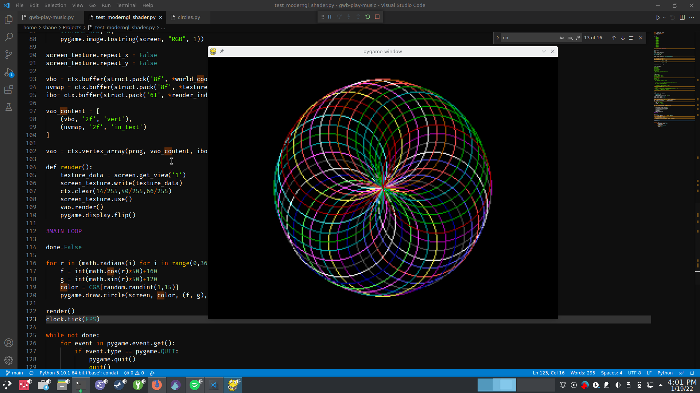

# Circles

Just a simple shape-drawing demo written in GW-BASIC, and rewritten in Python 3 and PyGame.
It simply draws circles of a radius of 50 pixels, in 10-degree increments, 50px from the
center of the screen, choosing a random color from the CGA 16-color palette.  In the PyGame version,
I've tried to annotate it as much as possbible, without making it unreadable.
At one point I had this working with a CRT shader with ModernGL, but I felt like it added too much complexity, especially since the ModernGL
code was more lines of code than the actual cirle-drawing.

The GW-BASIC version can be run in DOSBox in GW-BASIC, or in PC-BASIC, a fantastic
interpreter written in Python 3.  The Python version requires PyGame.
